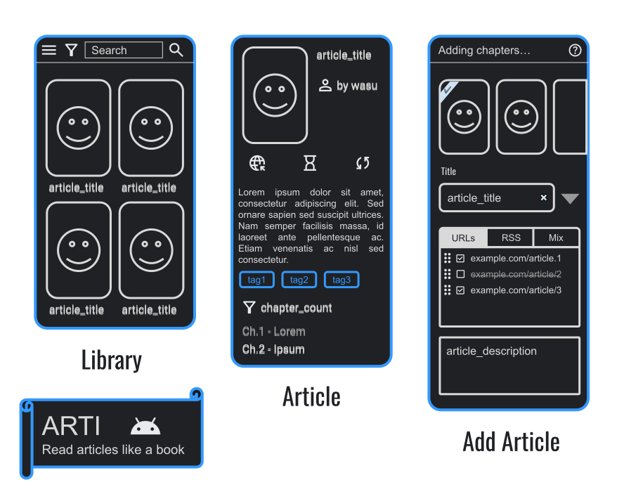

# Arti

Read articles like a book

## Planed features

Library

- display articles in Grid View (featuring cover image and title)
- add articles to library. For every article specify:
  - URL (or many URLs as chapters)
  - cover
    > gallery view allowing user to choose one of suggested covers or add custom cover from storage. Suggested covers may include:
    - content of `<meta property="og:image">` tag
    - first image on webpage
    - first image (excluding icons, etc.)
  - title
    > title field has a drop-down menu with suggested titles and is prefilled with the first of suggested titles. User can manually edit title in input field or clear the input field and input custom title. Suggested titles may include:
    - content of `<title>` tag
    - content of `<title>` tag with removed characters after `-`, `|` or `at` (name of website is usually included at the end)
    - content of opengraph title tag
    - first `h1` header on webpage
  - description - defaults to `<meta description>`
- support "Share menu" or "Open with..." dialog
  - Fast add - don't prompt user to edit metadata manually but uses first suggested option for each field
  - Manual - user can select from suggested options or manually fill fields
  - Add as chapter - adds chapter to article/book already in the library
  - Open without saving (or save manually after opening)
- rearrange chapters inside a book/article and edit their names

Reader

- Custom text select menu:
  - Translate(intent PROCESS_TEXT, in settings allow to set default app and broadcast intent on long press),
  - Set as title (change title of article to selected text)
- Long press on image:
  - save to downloads/pictures
  - set as article cover
- URL inside article (upon click):
  - add as chapter
  - open in external browser
  - open (as article, without saving)

Explore

- parse and display RSS feeds as a way to browse articles and quickly add them to library
